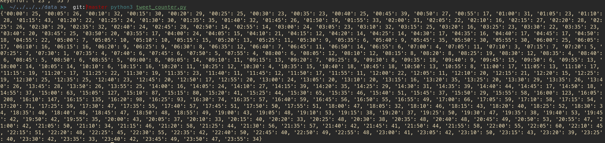
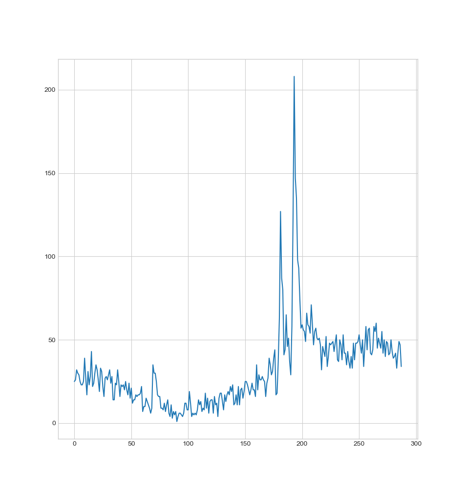
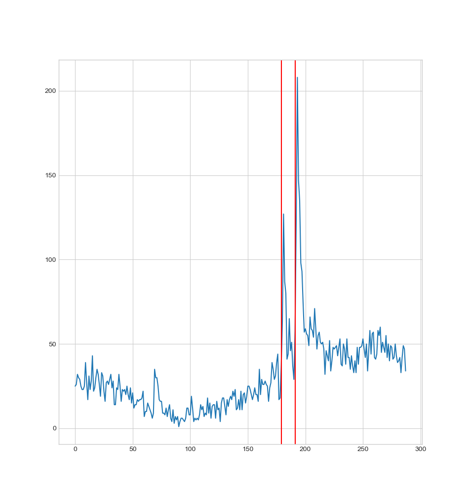

# Progreso del proyecto
## 06/11 (Primer día de trabajo) 
La idea era intentar conseguir los tweets de, por ejemplo, catorce días que contuvieran la palabra "bereal" y comprar la cantidad de estos tweets con la hora a la que sucedía el bereal de cada día. Esto me parecía buena idea porque da para una buena visualización y porque así aprendo un poco más sobre pandas y sobre las visualizaciones de datos.
### Conseguir los datos de las horas del Bereal
El primer paso para esto me parece bastante obvio: hace falta encontrar los datos de cuando han sucedido los últimos bereals. Primero he intentado encontrar alguna API que me ofreciera directamente los tiempos de los bereals en Python pero no ha habido suerte (quizá desarrollaré esto en un futuro) y lo único que he encontrado es una página (https://bereal.devin.fun/) que tiene los tiempos de los últimos 22 días, que ya me sirve. 
Para descargar estos datos los he descargado directamente a un .csv y cómo venían separados por región (aparentemente hay regiones en bereal, para que no salte a las 3 de la mañana un jueves en Laos supongo) así que he tenido que separarlos en diferentes archivos .csv más pequeños separados con región para poder ahorrarme una columna.
### Conseguir los tweets que contengan la palabra bereal y con sus horas de publicación correspondiente
El siguiente paso creo que es conseguir una lista de tweets (tantos como sea posible, porque van a hacer falta muchos datos) que contengan la palabra bereal. También hace falta que estos tuits tengan la hora de publicación, para poder compararlo con la hora del bereal.
Después de haber investigado un poco lo mejor será usar una librería llamada snscrape para encontrar los links de todos los tweets que cronologicamente contengan la palabra bereal y luego encontrar las fechas de esos tuits y guardarlos. Seguramente habrá una mejor manera pero es la más sencilla que he encontrado. Después de curiosear con la herramienta durante un rato he conseguidor recoger 16k tweets de 3 días de duración. He decidido que lo más lógico será sólo usar los de un día, porque será más fácil visualizar los datos. El día escogido será el 5 de Noviembre de 2022.

## 07/11 (Segundo día de trabajo)
### Tratar los datos de los tweets
El snscrape me da un montón de datos que no necesito, realmente no necesito ni el texto del tweet, sólo necesito saber que que hubo un tweet y en que momento sucedió. Así que primero elimino manualmente todos los tweets tanto del día 4 como del día 6 (ya que voy a visualizar los datos del día 5). Después de unrato de picar código he conseguido sacar la fecha y la hora de todos los tweets y ignorar todos los demás datos.

### Construir un diccionario con todos los datos
Ahora agruparé los tweets en intervalos ya que no hay datos suficientes como para hacerlo minuto a minuto así que he decidido agruparlo en intervalos de 5 minutos en 5 minutos. Ha tocado pelearse bastante con el código pero al final he podido construir un diccionario en el que tengo por un lado como keys los intervalos de 5 minutos en 5 minutos durante todo el día y de valores la cantidad de tweets que hay en ese intervalo de tiempo. Ahora ya tenemos el primer output de los datos pero es sólo por terminal, así que falta la parte de visualizar los datos de manera más visual.

### Construir un gráfico
Ahora falta la parte relativamente simple, lo único que hay que hacer es construir un gráfico con dos ejes, el eje X siendo los incrementos de tiempo y el eje Y la cantidad de tweets. Aunque soy consciente de que hay mil opciones mejores voy a usar matplotlib porque ya la conozco y porque produce resultados suficientemente decentes. Ahora ya podemos ver el primer gráfico. Lógicamente podemos ver "algo", aún no sabemos si ese es el resultado de que salte la notificación del bereal pero podemos ver que pasa algo. Hay varios picos bien marcados.

Lo siguiente será marcar con una linea vertical la hora de la notificación del bereal de ese día. Me podría romper la cabeza más pero sólo voy a ver en que hora fue ese día, ver que X es la que se acerca más a ese intervalo y ponerlo manualmente (lo sé, prácticas de mierda). Si visualizamos este gráfico vemos lo siguiente, el gran pico es la hora exacta del bereal, lo esperado. Lo que me pica aún un poco la curiosidad por el pico más pequeño de antes, una hora exacta antes de la hora del bereal de ese día, aunque supongo que tiene que ver con la diferencia horaria entre la mayoría de Europa y inglaterra, aunque no tengo muy claro sí el bereal va con la hora local o la hora del servidor central. Pero averiguar eso va a ser tarea para otro día me da a mí, no creo que este proyecto dé para mucho más, pero sí que voy a hacer lo de la API de poder sacar cualquier fecha del Bereal, que me apetece trastear con API's y tal.
